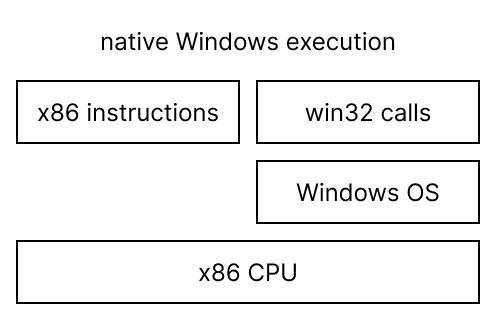
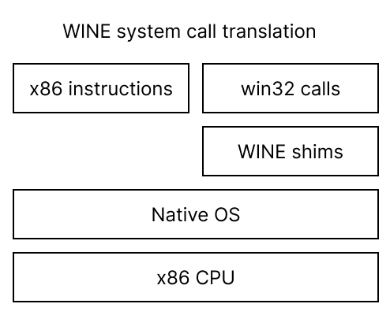
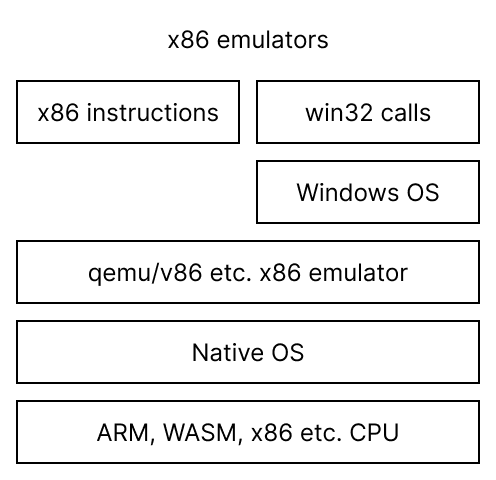
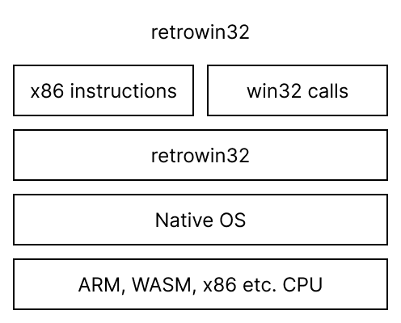

# Comparison with similar systems

Executing a Windows .exe broadly [requires two
components](https://neugierig.org/software/blog/2023/01/emulating-win32.html):
executing x86 instructions and interpreting the Windows calls.

To run it natively requires an x86 processor and the Windows OS:

[Wine](https://www.winehq.org/) translates Windows calls onto a different OS,
but still requires an x86 processor for the x86 instructions:

On non-x86 platforms you can pair Wine with a CPU emulator, as done in e.g.
[Boxedwine](https://www.boxedwine.org/).

x86 emulators like [qemu](https://www.qemu.org/) and [v86](https://copy.sh/v86/)
emulate an x86 processor, but at a level where it still requires you to run an
OS within the emulator:

This project, in contrast, aims to run a win32 executable directly, in a manner
similar to how video game emulators work: by both emulating the executable and
mapping its calls directly into local OS calls.

