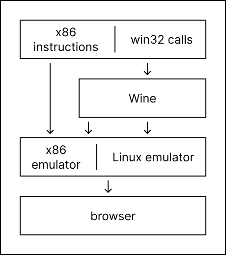

# Comparison with similar systems

To begin with, retrowin32 is relatively immature and cannot execute most
programs.

If you are just looking to Windows software, I recommend instead using:

- on x86 hardware: [Wine](https://www.winehq.org/)
- on non-x86 hardware: [qemu](https://www.qemu.org/)
- in a browser: [v86](https://copy.sh/v86/) or
  [Boxedwine](https://www.boxedwine.org/)

## Architectural differences

Executing a Windows .exe broadly
[requires two components](https://neugierig.org/software/blog/2023/01/emulating-win32.html):
executing x86 instructions and interpreting the Windows calls.

To run an exe natively requires both an x86 processor and the Windows OS:

[Wine](https://www.winehq.org/) translates Windows calls onto a different OS,
but still requires an x86 processor for the x86 instructions:

On non-x86 platforms (including browsers),
[Boxedwine](https://www.boxedwine.org/) combines Wine with a CPU emulator and
implementation of the bits of Linux that Wine expects:

x86 emulators like [qemu](https://www.qemu.org/) and [v86](https://copy.sh/v86/)
emulate an x86 processor, but at a level where it still requires you to run the
whole Windows OS within the emulator:

Finally, retrowin32 aims to run a win32 executable directly, in a manner similar
to how video game emulators work: by both emulating the executable and mapping
its calls directly into local OS calls.

Among the alternatives, retrowin32 is most similar to boxedwine. Note that while
this drawing is visually shorter, it still encompasses most of the same
complexity. The primary differences are:

- the bulk of retrowin32's win32 implementation happens outside of the x86
  emulator;
- retrowin32's win32 implementation doesn't depend on any Linux emulation, and
  can target the browser directly instead of SDL.
